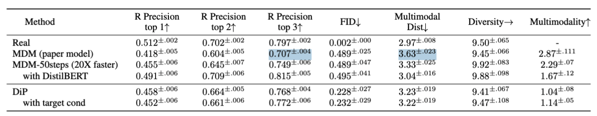
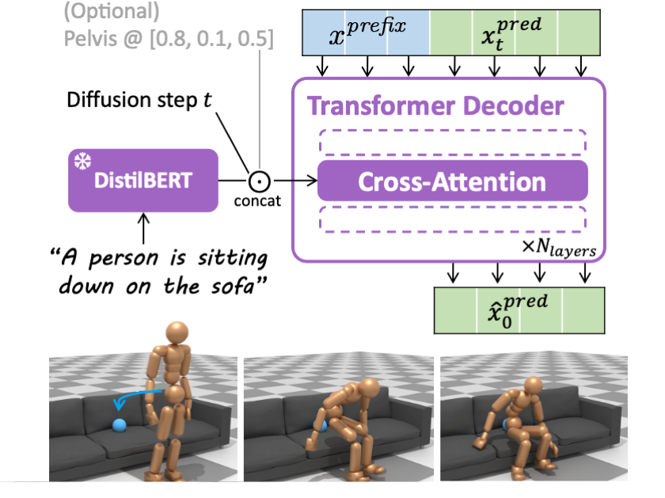

# DiP


Diffusion Planner (DiP) is an ultra-fast text-to-motion diffusion model. It is our newest version of [MDM](README.md)! It was published in the CLoSD paper [ICLR 2025 Spotlight]. To read more about it, check out the [CLoSD project page](https://guytevet.github.io/CLoSD-page/) and [code](https://github.com/GuyTevet/CLoSD).


## Performance


### Why is DiP so fast? Here's the TL;DR:


- DiP is autoregressive, it predicts the next 2 seconds of motion at each call.
- DiP uses only 10 diffusion steps (It performs well even with 5 steps).


## Results


The official results of MDM and DiP to cite in your paper:





- Blue marks entries from the original paper that have been corrected.
- You can use [this](assets/fixed_results.tex) `.tex` file.


## Bibtex


```
MDM:


@inproceedings{
tevet2023human,
title={Human Motion Diffusion Model},
author={Guy Tevet and Sigal Raab and Brian Gordon and Yoni Shafir and Daniel Cohen-or and Amit Haim Bermano},
booktitle={The Eleventh International Conference on Learning Representations },
year={2023},
url={https://openreview.net/forum?id=SJ1kSyO2jwu}
}


DiP and CLoSD:


@article{tevet2024closd,
 title={CLoSD: Closing the Loop between Simulation and Diffusion for multi-task character control},
 author={Tevet, Guy and Raab, Sigal and Cohan, Setareh and Reda, Daniele and Luo, Zhengyi and Peng, Xue Bin and Bermano, Amit H and van de Panne, Michiel},
 journal={arXiv preprint arXiv:2410.03441},
 year={2024}
}
```


## Architecture


- DiP is a transformer decoder.
- It encode the text using a fixed [DistilBERT](https://huggingface.co/docs/transformers/en/model_doc/distilbert).
- It enables additional target location condition, that was used in [CLoSD](https://guytevet.github.io/CLoSD-page/) for object interaction.
- At each diffusion step, it gets the prefix (clean) and the prediction, noised to `t`.
- For the full implementation details, check out [the paper](https://arxiv.org/abs/2410.03441).





## Setup


Follow the setup instructions of [MDM](README.md), then download the checkpoints and place them at `save/`


### Model Checkpoints


[DiP](https://huggingface.co/guytevet/CLoSD/tree/main/checkpoints/dip/DiP_no-target_10steps_context20_predict40) For text-to-motion. 
- Identical to the one in CLoSD.


[DiP with target conditioning](https://drive.google.com/file/d/1PsilP2xhcOHHXkmtxtOwNbWeI0njU2ic/view?usp=sharing) For the CLoSD applications. 
- Slightly different from the one in CLoSD, as it supports both with and without target conditioning.


- **Note:** DiP code is also included in the [CLoSD code base](https://github.com/GuyTevet/CLoSD). If you would like to run the full CLoSD system you better use it instead.


## Demo

It would be amazing to have one (we don’t yet 😬). Create one, and eternal glory shall be yours!


## Generate


```shell
python -m sample.generate \
   --model_path save/target_10steps_context20_predict40/model000200000.pt \
   --autoregressive --guidance_param 7.5
```


- This will use prompts from the dataset.
- In case you want to use your own prompt, add `--text_prompt "A person throws a ball."`.
- In case you want to change the prompt on the fly, add `--dynamic_text_path assets/example_dynamic_text_prompts.txt`. Here, each line corresponds to a single prediction, i.e. two seconds of motion.
- **Note:** The initial prefix will still be sampled from the data. For example, if you ask the person to throw a ball and you happen to sample a sitting prefix, it will first need to get up before throwing.


**You may also define:**


* `--num_samples` (default is 10) / `--num_repetitions` (default is 3).
* `--device` id.
* `--seed` to sample different prompts.
* `--motion_length` (text-to-motion only) in seconds.


**Running those will get you:**


* `results.npy` file with text prompts and xyz positions of the generated animation
* `sample##_rep##.mp4` - a stick figure animation for each generated motion.


## Evaluate


The evaluation results can be found in the `.log` file of each checkpoint dir.
To reproduce it, run:


```shell
python -m eval.eval_humanml --model_path save/DiP_no-target_10steps_context20_predict40/model000600343.pt  --autoregressive --guidance_param 7.5
```


**You may also define:**
* `--train_platform_type WandBPlatform` to log the results in WanDB.
* `--eval_mode mm_short` to calculate the multimodality metric.


## Train your own DiP


To reproduce DiP, run:


```shell
python -m train.train_mdm\
--save_dir save/my_humanml_DiP \
--dataset humanml --arch trans_dec --text_encoder_type bert \
--diffusion_steps 10 --context_len 20 --pred_len 40 \
--mask_frames --use_ema --autoregressive --gen_guidance_param 7.5
```


* **Recommended:** Add `--eval_during_training` and `--gen_during_training` to evaluate and generate motions for each saved checkpoint.
 This will slow down training but will give you better monitoring.
* **Recommended:** Add `--use_ema` for Exponential Moving Average, and `--mask_frames` to fix a masking bug. Both improve performance.
* To add target conditioning for the CLoSD applications, add `--lambda_target_loc 1.`.
* Use `--device` to define GPU id.
* Use `--arch` to choose one of the architectures reported in the paper `{trans_enc, trans_dec, gru}` (`trans_enc` is the default).
* Use `--text_encoder_type` to choose the text encoder `{clip, bert}` (`clip` is default).
* Add `--train_platform_type {WandBPlatform, TensorboardPlatform}` to track results with either [WandB](https://wandb.ai/site/) or [Tensorboard](https://www.tensorflow.org/tensorboard).
