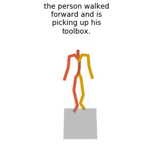
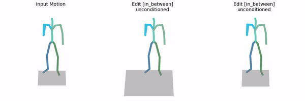
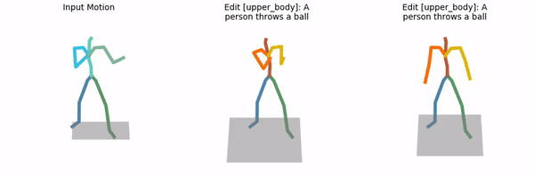

# MDM: Human Motion Diffusion Model


[](https://arxiv.org/abs/2209.14916)
<a href="https://replicate.com/arielreplicate/motion_diffusion_model"></a>

The official PyTorch implementation of the paper [**"Human Motion Diffusion Model"**](https://arxiv.org/abs/2209.14916).

Please visit our [**webpage**](https://guytevet.github.io/mdm-page/) for more details.


#### Bibtex
If you find this code useful in your research, please cite:

```
@inproceedings{
tevet2023human,
title={Human Motion Diffusion Model},
author={Guy Tevet and Sigal Raab and Brian Gordon and Yoni Shafir and Daniel Cohen-or and Amit Haim Bermano},
booktitle={The Eleventh International Conference on Learning Representations },
year={2023},
url={https://openreview.net/forum?id=SJ1kSyO2jwu}
}
```

## Checkout MDM Follow-ups (partial list)

🐉 [SinMDM](https://sinmdm.github.io/SinMDM-page/) - Learns single motion motifs - even for non-humanoid characters.

👯 [PriorMDM](https://priormdm.github.io/priorMDM-page/) - Uses MDM as a generative prior, enabling new generation tasks with few examples or even no data at all.

🍏 [PhysDiff](https://nvlabs.github.io/PhysDiff/) - Adds physical guidance to MDM to generate more realistic results.

💃 [EDGE](https://edge-dance.github.io/) - Learns music-to-dance motion with MDM and off-the-shelf audio encoder.


## News

📢 **1/Jun/23** - Fixed generation issue (#104) - Please pull to improve generation results.

📢 **23/Nov/22** - Fixed evaluation issue (#42) - Please pull and run `bash prepare/download_t2m_evaluators.sh` from the top of the repo to adapt.

📢 **4/Nov/22** - Added sampling, training and evaluation of unconstrained tasks.
  Note slight env changes adapting to the new code. If you already have an installed environment, run `bash prepare/download_unconstrained_assets.sh; conda install -y -c anaconda scikit-learn
` to adapt.

📢 **3/Nov/22** - Added in-between and upper-body editing.

📢 **31/Oct/22** - Added sampling, training and evaluation of action-to-motion tasks.

📢 **9/Oct/22** - Added training and evaluation scripts. 
  Note slight env changes adapting to the new code. If you already have an installed environment, run `bash prepare/download_glove.sh; pip install clearml` to adapt.

📢 **6/Oct/22** - First release - sampling and rendering using pre-trained models.


## Getting started

This code was tested on `Ubuntu 18.04.5 LTS` and requires:

* Python 3.7
* conda3 or miniconda3
* CUDA capable GPU (one is enough)

### 1. Setup environment

Install ffmpeg (if not already installed):

```shell
sudo apt update
sudo apt install ffmpeg
```
For windows use [this](https://www.geeksforgeeks.org/how-to-install-ffmpeg-on-windows/) instead.

Setup conda env:
```shell
conda env create -f environment.yml
conda activate mdm
python -m spacy download en_core_web_sm
pip install git+https://github.com/openai/CLIP.git
```

Download dependencies:

<details>
  <summary><b>Text to Motion</b></summary>

```bash
bash prepare/download_smpl_files.sh
bash prepare/download_glove.sh
bash prepare/download_t2m_evaluators.sh
```
</details>

<details>
  <summary><b>Action to Motion</b></summary>

```bash
bash prepare/download_smpl_files.sh
bash prepare/download_recognition_models.sh
```
</details>

<details>
  <summary><b>Unconstrained</b></summary>

```bash
bash prepare/download_smpl_files.sh
bash prepare/download_recognition_models.sh
bash prepare/download_recognition_unconstrained_models.sh
```
</details>

### 2. Get data

<details>
  <summary><b>Text to Motion</b></summary>

There are two paths to get the data:

(a) **Go the easy way if** you just want to generate text-to-motion (excluding editing which does require motion capture data)

(b) **Get full data** to train and evaluate the model.


#### a. The easy way (text only)

**HumanML3D** - Clone HumanML3D, then copy the data dir to our repository:

```shell
cd ..
git clone https://github.com/EricGuo5513/HumanML3D.git
unzip ./HumanML3D/HumanML3D/texts.zip -d ./HumanML3D/HumanML3D/
cp -r HumanML3D/HumanML3D motion-diffusion-model/dataset/HumanML3D
cd motion-diffusion-model
```


#### b. Full data (text + motion capture)

**HumanML3D** - Follow the instructions in [HumanML3D](https://github.com/EricGuo5513/HumanML3D.git),
then copy the result dataset to our repository:

```shell
cp -r ../HumanML3D/HumanML3D ./dataset/HumanML3D
```

**KIT** - Download from [HumanML3D](https://github.com/EricGuo5513/HumanML3D.git) (no processing needed this time) and the place result in `./dataset/KIT-ML`
</details>

<details>
  <summary><b>Action to Motion</b></summary>

**UESTC, HumanAct12** 
```bash
bash prepare/download_a2m_datasets.sh
```
</details>

<details>
  <summary><b>Unconstrained</b></summary>

**HumanAct12** 
```bash
bash prepare/download_unconstrained_datasets.sh
```
</details>

### 3. Download the pretrained models

Download the model(s) you wish to use, then unzip and place them in `./save/`. 

<details>
  <summary><b>Text to Motion</b></summary>

**You need only the first one.** 

**HumanML3D**

[humanml-encoder-512](https://drive.google.com/file/d/1PE0PK8e5a5j-7-Xhs5YET5U5pGh0c821/view?usp=sharing) (best model)

[humanml-decoder-512](https://drive.google.com/file/d/1q3soLadvVh7kJuJPd2cegMNY2xVuVudj/view?usp=sharing)

[humanml-decoder-with-emb-512](https://drive.google.com/file/d/1GnsW0K3UjuOkNkAWmjrGIUmeDDZrmPE5/view?usp=sharing)

**KIT**

[kit-encoder-512](https://drive.google.com/file/d/1SHCRcE0es31vkJMLGf9dyLe7YsWj7pNL/view?usp=sharing)

</details>

<details>
  <summary><b>Action to Motion</b></summary>

**UESTC**

[uestc](https://drive.google.com/file/d/1goB2DJK4B-fLu2QmqGWKAqWGMTAO6wQ6/view?usp=sharing)

[uestc_no_fc](https://drive.google.com/file/d/1fpv3mR-qP9CYCsi9CrQhFqlLavcSQky6/view?usp=sharing)

**HumanAct12**

[humanact12](https://drive.google.com/file/d/154X8_Lgpec6Xj0glEGql7FVKqPYCdBFO/view?usp=sharing)

[humanact12_no_fc](https://drive.google.com/file/d/1frKVMBYNiN5Mlq7zsnhDBzs9vGJvFeiQ/view?usp=sharing)

</details>

<details>
  <summary><b>Unconstrained</b></summary>

**HumanAct12**

[humanact12_unconstrained](https://drive.google.com/file/d/1uG68m200pZK3pD-zTmPXu5XkgNpx_mEx/view?usp=share_link)

</details>


## Motion Synthesis
<details>
  <summary><b>Text to Motion</b></summary>

### Generate from test set prompts

```shell
python -m sample.generate --model_path ./save/humanml_trans_enc_512/model000200000.pt --num_samples 10 --num_repetitions 3
```

### Generate from your text file

```shell
python -m sample.generate --model_path ./save/humanml_trans_enc_512/model000200000.pt --input_text ./assets/example_text_prompts.txt
```

### Generate a single prompt

```shell
python -m sample.generate --model_path ./save/humanml_trans_enc_512/model000200000.pt --text_prompt "the person walked forward and is picking up his toolbox."
```
</details>

<details>
  <summary><b>Action to Motion</b></summary>

### Generate from test set actions

```shell
python -m sample.generate --model_path ./save/humanact12/model000350000.pt --num_samples 10 --num_repetitions 3
```

### Generate from your actions file

```shell
python -m sample.generate --model_path ./save/humanact12/model000350000.pt --action_file ./assets/example_action_names_humanact12.txt
```

### Generate a single action

```shell
python -m sample.generate --model_path ./save/humanact12/model000350000.pt --action_name "drink"
```
</details>

<details>
  <summary><b>Unconstrained</b></summary>

```shell
python -m sample.generate --model_path ./save/unconstrained/model000450000.pt --num_samples 10 --num_repetitions 3
```

By abuse of notation, (num_samples * num_repetitions) samples are created, and are visually organized in a display of num_samples rows and num_repetitions columns.

</details>

**You may also define:**
* `--device` id.
* `--seed` to sample different prompts.
* `--motion_length` (text-to-motion only) in seconds (maximum is 9.8[sec]).

**Running those will get you:**

* `results.npy` file with text prompts and xyz positions of the generated animation
* `sample##_rep##.mp4` - a stick figure animation for each generated motion.

It will look something like this:



You can stop here, or render the SMPL mesh using the following script.

### Render SMPL mesh

To create SMPL mesh per frame run:

```shell
python -m visualize.render_mesh --input_path /path/to/mp4/stick/figure/file
```

**This script outputs:**
* `sample##_rep##_smpl_params.npy` - SMPL parameters (thetas, root translations, vertices and faces)
* `sample##_rep##_obj` - Mesh per frame in `.obj` format.

**Notes:**
* The `.obj` can be integrated into Blender/Maya/3DS-MAX and rendered using them.
* This script is running [SMPLify](https://smplify.is.tue.mpg.de/) and needs GPU as well (can be specified with the `--device` flag).
* **Important** - Do not change the original `.mp4` path before running the script.

**Notes for 3d makers:**
* You have two ways to animate the sequence:
  1. Use the [SMPL add-on](https://smpl.is.tue.mpg.de/index.html) and the theta parameters saved to `sample##_rep##_smpl_params.npy` (we always use beta=0 and the gender-neutral model).
  1. A more straightforward way is using the mesh data itself. All meshes have the same topology (SMPL), so you just need to keyframe vertex locations. 
     Since the OBJs are not preserving vertices order, we also save this data to the `sample##_rep##_smpl_params.npy` file for your convenience.

## Motion Editing

* This feature is available for text-to-motion datasets (HumanML3D and KIT).
* In order to use it, you need to acquire the full data (not just the texts).
* We support the two modes presented in the paper: `in_between` and `upper_body`.

### Unconditioned editing

```shell
python -m sample.edit --model_path ./save/humanml_trans_enc_512/model000200000.pt --edit_mode in_between
```

**You may also define:**
* `--num_samples` (default is 10) / `--num_repetitions` (default is 3).
* `--device` id.
* `--seed` to sample different prompts.
* `--edit_mode upper_body` For upper body editing (lower body is fixed).


The output will look like this (blue frames are from the input motion; orange were generated by the model):



* As in *Motion Synthesis*, you may follow the **Render SMPL mesh** section to obtain meshes for your edited motions.

### Text conditioned editing

Just add the text conditioning using `--text_condition`. For example:

```shell
python -m sample.edit --model_path ./save/humanml_trans_enc_512/model000200000.pt --edit_mode upper_body --text_condition "A person throws a ball"
```

The output will look like this (blue joints are from the input motion; orange were generated by the model):



## Train your own MDM

<details>
  <summary><b>Text to Motion</b></summary>

**HumanML3D**
```shell
python -m train.train_mdm --save_dir save/my_humanml_trans_enc_512 --dataset humanml
```

**KIT**
```shell
python -m train.train_mdm --save_dir save/my_kit_trans_enc_512 --dataset kit
```
</details>
<details>
  <summary><b>Action to Motion</b></summary>

```shell
python -m train.train_mdm --save_dir save/my_name --dataset {humanact12,uestc} --cond_mask_prob 0 --lambda_rcxyz 1 --lambda_vel 1 --lambda_fc 1
```
</details>

<details>
  <summary><b>Unconstrained</b></summary>

```shell
python -m train.train_mdm --save_dir save/my_name --dataset humanact12 --cond_mask_prob 0 --lambda_rcxyz 1 --lambda_vel 1 --lambda_fc 1  --unconstrained
```
</details>

* Use `--device` to define GPU id.
* Use `--arch` to choose one of the architectures reported in the paper `{trans_enc, trans_dec, gru}` (`trans_enc` is default).
* Add `--train_platform_type {ClearmlPlatform, TensorboardPlatform}` to track results with either [ClearML](https://clear.ml/) or [Tensorboard](https://www.tensorflow.org/tensorboard).
* Add `--eval_during_training` to run a short (90 minutes) evaluation for each saved checkpoint. 
  This will slow down training but will give you better monitoring.

## Evaluate

<details>
  <summary><b>Text to Motion</b></summary>

* Takes about 20 hours (on a single GPU)
* The output of this script for the pre-trained models (as was reported in the paper) is provided in the checkpoints zip file.

**HumanML3D**
```shell
python -m eval.eval_humanml --model_path ./save/humanml_trans_enc_512/model000475000.pt
```

**KIT**
```shell
python -m eval.eval_humanml --model_path ./save/kit_trans_enc_512/model000400000.pt
```
</details>

<details>
  <summary><b>Action to Motion</b></summary>

* Takes about 7 hours for UESTC and 2 hours for HumanAct12 (on a single GPU)
* The output of this script for the pre-trained models (as was reported in the paper) is provided in the checkpoints zip file.

```shell
python -m eval.eval_humanact12_uestc --model <path-to-model-ckpt> --eval_mode full
```
where `path-to-model-ckpt` can be a path to any of the pretrained action-to-motion models listed above, or to a checkpoint trained by the user.

</details>


<details>
  <summary><b>Unconstrained</b></summary>

* Takes about 3 hours (on a single GPU)

```shell
python -m eval.eval_humanact12_uestc --model ./save/unconstrained/model000450000.pt --eval_mode full
```

Precision and recall are not computed to save computing time. If you wish to compute them, edit the file eval/a2m/gru_eval.py and change the string `fast=True` to `fast=False`.

</details>

## Acknowledgments

This code is standing on the shoulders of giants. We want to thank the following contributors
that our code is based on:

[guided-diffusion](https://github.com/openai/guided-diffusion), [MotionCLIP](https://github.com/GuyTevet/MotionCLIP), [text-to-motion](https://github.com/EricGuo5513/text-to-motion), [actor](https://github.com/Mathux/ACTOR), [joints2smpl](https://github.com/wangsen1312/joints2smpl), [MoDi](https://github.com/sigal-raab/MoDi).

## License
This code is distributed under an [MIT LICENSE](LICENSE).

Note that our code depends on other libraries, including CLIP, SMPL, SMPL-X, PyTorch3D, and uses datasets that each have their own respective licenses that must also be followed.
